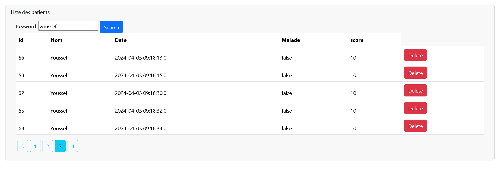

# Spring Boot Patient Management Application

This project is a Spring Boot application for managing patients of a Hospital. It uses JPA for data persistence, H2 for the initial in-memory database, and later migrates to MySQL for production.

## Getting Started

To get started with this project, follow these steps:

### Prerequisites

- Java 8 or higher installed
- Maven installed
- IntelliJ IDEA Ultimate installed
- xampp installed

### Installation

1. Clone the repository.
   ```bash
   git clone https://github.com/3310N/JEE_InevDeps_ProdManagment.git
    ```
2. Open the project in IntelliJ IDEA.
3. Run the project.
4. Open a web browser and navigate to `http://localhost:8085`.

## Usage

The application allows you to perform the following operations:

- Create a new product
- Update an existing product
- Delete a product
- View a list of all products
- View a product by ID
- Search for a product by name
- Sort products by name, price, or category

## Objectives

- Learn how to create a Spring Boot application
- Learn how to use JPA for data persistence
- Learn how to use H2 for an in-memory database
- Learn how to migrate from H2 to MySQL

## Technologies

- Java
- Spring Boot
- JPA
- H2
- MySQL
- Lombok


## Resources

- [Spring Boot](https://spring.io/projects/spring-boot)
- [JPA](https://spring.io/projects/spring-data-jpa)
- [H2](https://www.h2database.com/html/main.html)
- [MySQL](https://www.mysql.com/)
- [Lombok](https://projectlombok.org/)
- [IntelliJ IDEA](https://www.jetbrains.com/idea/)
## Diagrams

 

## Screanshots of the application

1. Creation of Spring project with the dependencies JPA, H2, Spring Web, and Lombok
* Project creation
  
* Dependencies
  

2. Creation of the JPA entity Patient with the attributes:

   `private Long id;`,
   `private int score;`,
   `private Date dateNaissance;`,
   `private boolean malade;,`,
   


3. Patient Repository

4. Patient Controller

5. showing patients in the Thymeleaf template

6. Result of the Thymeleaf:

7. Adding pagination to the Thymeleaf template with SIZE and PAGE parameters

8. Result of the Thymeleaf with pagination

9. Adding a search form to the Thymeleaf template


10. Result of the Thymeleaf with search form

11. Delleting a patient 

12. Result of the Thymeleaf after deleting a patient


## License

This project is licensed under the MIT License - see the [LICENSE](https://www.youtube.com/watch?v=xvFZjo5PgG0) file for details.
``` 
LICENSE
    
Copyright (c) 2024 EL Mahdi Masbah

Permission is hereby granted, free of charge, to any person obtaining a copy of this software and associated documentation files (the "Software"), to deal in the Software without restriction, including without limitation the rights to use, copy, modify, merge, publish, distribute, sublicense, and/or sell copies of the Software, and to permit persons to whom the Software is furnished to do so, subject to the following conditions:

The above copyright notice and this permission notice shall be included in all copies or substantial portions of the Software.

THE SOFTWARE IS PROVIDED "AS IS", WITHOUT WARRANTY OF ANY KIND, EXPRESS OR IMPLIED, INCLUDING BUT NOT LIMITED TO THE WARRANTIES OF MERCHANTABILITY, FITNESS FOR A PARTICULAR PURPOSE AND NONINFRINGEMENT. IN NO EVENT SHALL THE AUTHORS OR COPYRIGHT HOLDERS BE LIABLE FOR ANY CLAIM, DAMAGES OR OTHER LIABILITY, WHETHER IN AN ACTION OF CONTRACT, TORT OR OTHERWISE, ARISING FROM, OUT OF OR IN CONNECTION WITH THE SOFTWARE OR THE USE OR OTHER DEALINGS IN THE SOFTWARE.
```